# VSCode

Installation instructions are written for a Linux *buntu system.  

Other systems, download from [https://code.visualstudio.com/Download](https://code.visualstudio.com/Download) and follow the guides at [https://code.visualstudio.com/docs/setup/setup-overview](https://code.visualstudio.com/docs/setup/setup-overview).  

## Installation

Download and install keys  
>$ wget -qO- https://packages.microsoft.com/keys/microsoft.asc | gpg --dearmor > packages.microsoft.gpg  
>$ sudo install -o root -g root -m 644 packages.microsoft.gpg /etc/apt/trusted.gpg.d/  
>$ sudo sh -c 'echo "deb [arch=amd64,arm64,armhf signed-by=/etc/apt/trusted.gpg.d/packages.microsoft.gpg] https://packages.microsoft.com/repos/code stable main" > /etc/apt/sources.list.d/vscode.list'  
>$ rm -f packages.microsoft.gpg  

Install prerequisites  
>$ sudo apt install apt-transport-https  

Update and install  
>$ sudo apt update  
>$ sudo apt install code  

## Setup VSCode

Start VSCode from menu, or from cli:  
>$ code  

### Install PlatformIO IDE extension

Click 'Extensions'  
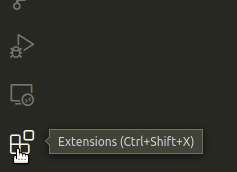

Search for 'platformio' and then click it  
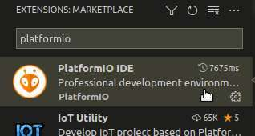

Click 'Install' (in the picture it's already installed)  
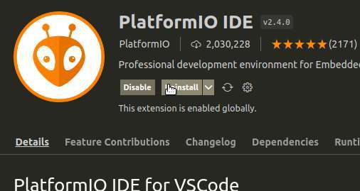

### Install Auto Build Marlin extension

Again, open 'Extensions' and search for 'marlin'  
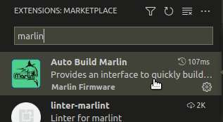

Click 'Install' (in the picture it's already installed)  
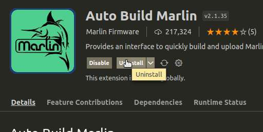

## Get sources

Download sources  
>$ git clone https://github.com/jonsag/Marlin-3D-Printer-Firmware

## Configure Marlin

Open directory with Marlin sources in VSCode  
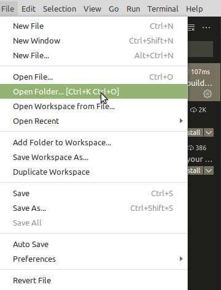

Select the directory with the Marlin sources (in this example I'm using 2.0.9.2)  
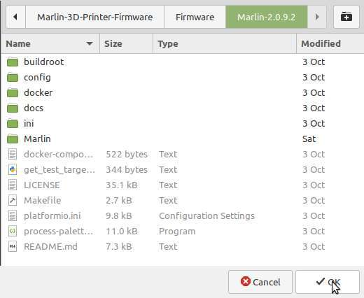

Open and edit the configuration files to your needs  
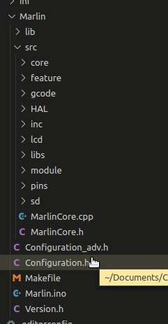

## Build and upload Marlin

Select 'Auto Build Marlin' menu  
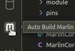

Click 'Show ABM Panel'  
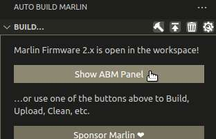

Click 'Build' for 'mega2560'  
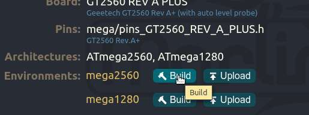

If all went well you got the firmware binaries at  

    .pio/build/mega2560/firmware.hex  

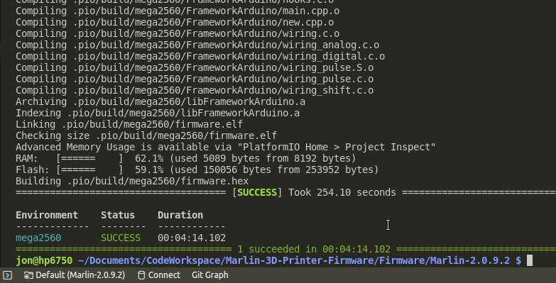

Save this file for later, or upload it now  
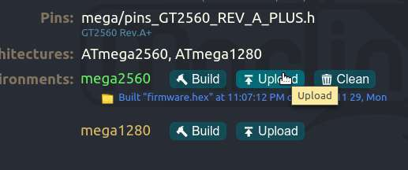
